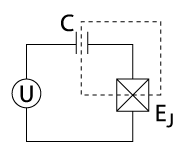
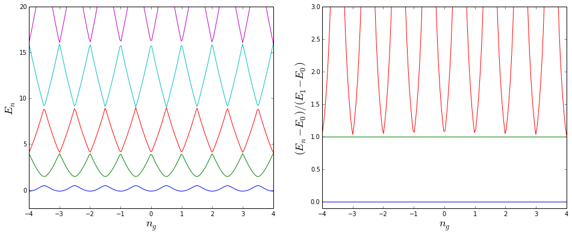
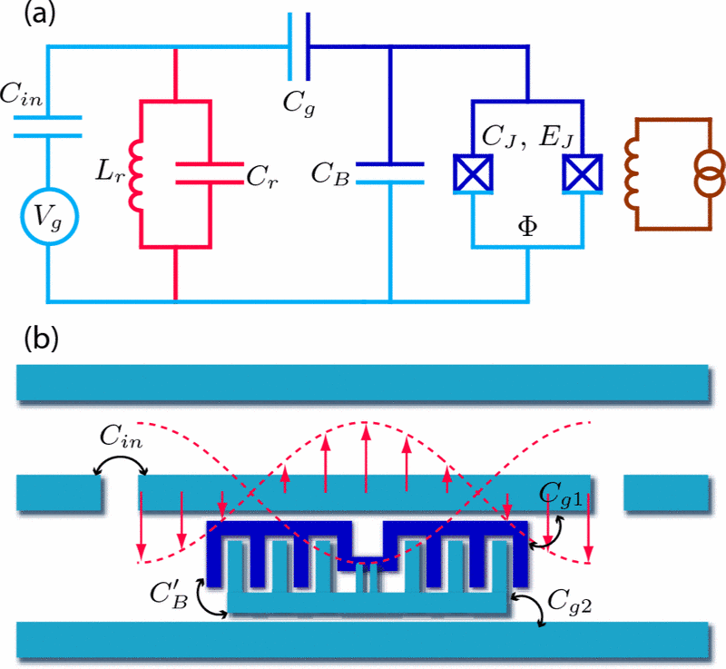
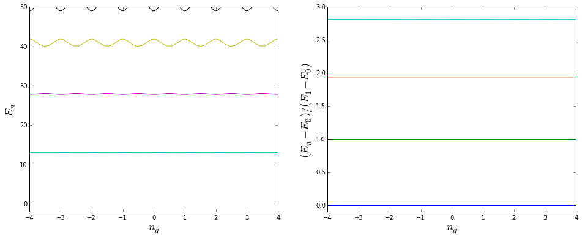

---
title:
- Primer avance
author:
- Miguel Casanova
header-includes:
   - \usepackage{physics}
   - \usepackage{mathtools}
   - \usepackage{physics}
   - \usepackage{qcircuit}
   - \usepackage{graphicx}
   - \usepackage{float}
   - \usepackage{dsfont}
   - \usepackage{tkz-graph}
   - \usetikzlibrary{arrows}
theme:
- Copenhagen
---
# Bracket de Poisson y coordenadas canónicas

El bracket de Poisson de dos funciones en coordenadas canónicas es

$$\{f,g\} = \sum\limits_{i=1}^N (\frac{\partial f}{\partial q_i}
 \frac{\partial g}{\partial p_i} - \frac{\partial f}{\partial p_i}
 \frac{\partial g}{\partial q_i})$$

Donde p y q cumplen que:

$\{q_i,q_j\}=0; \qquad \quad \{p_i,p_j\}=0; \qquad \quad
 \{q_i,p_j\}=\delta_{i,j}$

Tradicionalmente, p y q representan posición y momentum, respectivamente.

# Mecánica Hamiltoniana

En la mecánica Hamiltoniana, la evolución dinámica de un sistema clásico
está descrito por un conjunto de variables canónicas conjugadas $r=(q,p)$
de la siguiente manera:

$$\frac{dp}{dt}=-\frac{\partial H}{\partial q} \qquad \quad 
 \frac{dq}{dt}=+\frac{\partial H}{\partial p}$$

Donde el Hamiltoniano $H$ es la suma de la energía potencial $V$ y
la energía cinética $T$, $H=T+V$.

# Ejemplo: Oscilador armónico masa-resorte

$$H=T+V=\frac{p^2}{2m}+\frac{k q^2}{2}$$

$p=mv=m \frac{dq}{dt}; \qquad \quad \omega=\sqrt{\frac{k}{m}}; \qquad \quad
 m \frac{d^2q}{dt^2} + k q=0$

$-\frac{\partial H}{\partial q} = -k q = m \frac{d^2q}{dt^2} = \frac{dp}{dt};
 \qquad \quad \frac{\partial H}{\partial p} = \frac{p}{m} = \frac{dq}{dt}$

$\{q,q\} = \frac{\partial q}{\partial q_i}
 \frac{\partial q}{\partial p_i} - \frac{\partial q}{\partial p_i}
 \frac{\partial q}{\partial q_i} = 0$

$\{p,p\} = \frac{\partial p}{\partial q_i}
 \frac{\partial p}{\partial p_i} - \frac{\partial p}{\partial p_i}
 \frac{\partial p}{\partial q_i} = 0$

$\{q,p\} = \frac{\partial q}{\partial q_i}
 \frac{\partial p}{\partial p_i} - \frac{\partial q}{\partial p_i}
 \frac{\partial p}{\partial q_i} = 1$

# Cuantización canónica

Paul Dirac introdujo en su tesis doctoral en 1926 el "método de analogía
clásica" para la cuantización de sistemas físicos.

Este método consiste en cuantizar las teorías clásicas intentando mantener
las estructuras formales de la teoría clásica en la mayor medida posible.

Dirac propuso la siguiente relación: $\{q,p\} \rightarrow \frac{1}{i\hbar}
[\hat{q},\hat{p}]$

Luego se demostró que esta relación no se para todo sistema físico,
sino que es un caso especial de una relación más general. Sin embargo,
para los casos a estudiar en esta presentación, sí se cumple.

# Cuantización canónica: La receta

El procedimientro a seguir será:

* Construir el Hamiltoniano clásico del sistema en términos de
 coordenadas canónicas
* Sustituir los observables por operadores cuánticos
* Forzar la relación de conmutación canónica

# Oscilador armónico LC: Hamiltoniano clásico

Un ejemplo de variables canónicamente conjugades son la carga y el flujo
magnético. Por esto, podemos cuántizar un oscilador armónico LC con la
cuantización canónica.

La energía en un capacitor es $\frac{Q^2}{2C}$

La energía en un inductor es $\frac{\phi^2}{2L}$

Por lo tanto, el Hamiltoniano clásico del sistema es:

$$H = \frac{Q^2}{2C} + \frac{\phi^2}{2L}$$

# Oscilador armónico LC: Cuantización canónica

$\frac{\partial H}{\partial Q} = \frac{Q}{C} = -L \frac{dI}{dt} =
 -\frac{d\phi}{dt}; \qquad \quad
 \frac{\partial H}{\partial \phi} = \frac{\phi}{L} = I = \frac{dQ}{dt}$

Esto demuestra que $\phi$ y $Q$ son coordenadas canónicas. Donde $\phi$ y $Q$
son posición y momentum generalizados, respectivamente. Así que procedemos
a sustituirlas por los operadores $\hat{\phi}$ y $\hat{q}$ y escribimos el
Hamiltoniano cuántico

$$\hat{H} = \frac{\hat{q}^2}{2C} + \frac{\hat{\phi}^2}{2L}$$

Donde $[\hat{\phi},\hat{q}]= i \hbar$

Esto, además, significa que la carga en el capacitor y el flujo en el inductor
no pueden ser medidos simultaneamente.

Finalmente, la frecuencia de resonancia de este oscilador es $\omega = 
\frac{1}{\sqrt{L C}}$ y los niveles de energía se encuentran separados por
$\hbar \omega$

# Efecto Josephson

Se tienen dos placas superconductoras A y B, separadas por un aislante.
Las funciones de onda de las placas superconductoras son:
$\psi_A = \sqrt{\rho_1} e^{i \phi_1}, \psi_B = \sqrt{\rho_2} e^{i \phi_2}$ 

En principio, no debería haber una supercorriente entre ambas placas.
Sin embargo, ese no es el caso. Por el efecto tunel, pares de electrones
(pares de Cooper) pueden pasar de una placa a la otra sin disipación.

$$V_J = \frac{\hbar}{2e} \frac{d\delta}{dt}$$

$$I_J = I_0 \sin(\delta)$$

Donde $\delta=\phi_2-\phi_1$ es la diferencia de fase entre las dos placas superconductoras.

# Efecto Josephson DC y AC

* Efecto Josephson DC

Si las placas se encuentran sin alimentación, entonces correrá una
supercorriente constante a través de ellas.

* Efecto Josephson AC

Si las placas se alimentan con un voltaje DC externo, entonces la diferencia
de fase entre ellas variará linealmente con el tiempo y habrá una corriente AC
a través de ellas.

# Energía e inductancia de Josephson

$$E_J = \int I_0 \sin(\delta) \frac{\hbar}{2e} \frac{d\delta}{dt} dt
 = \frac{\hbar I_0}{2e} \int \sin(\delta) dt
 = - \frac{\hbar I_0}{2e} \cos(\delta)$$

$\frac{dI_J}{dt} = I_0 \cos(\delta) \frac{d \delta}{dt} = I_0 \cos(\delta)
 \frac{2e}{\hbar} V_J$

$$L_J = \frac{\hbar}{2e I_0 \cos(\delta)}$$

$E_C = \frac{(2e)^2}{2C}$

$E_L = \frac{\hbar^2}{(2e)^2L}$

# Circuito LCJ

Primero, reescribimos el Hamiltoniano del circuito LC en términos de la
cantidad de pares de Cooper y de la diferencia de fase en los extremos
del inductor, en lugar de la carga y el flujo

$$\hat{H} = \frac{(2e)^2}{2C} \hat{n}^2 + \frac{\hbar^2}{(2e)^2L} 
 \frac{\hat{\delta^2}}{2}$$

De aquí $\hat{q}=2e\hat{n}$ y $\hat{\phi}=\frac{\hbar}{2e}\hat{\delta}$

Ahora introducimos el término de la unión Josephson

$\hat{H} = \frac{(2e)^2}{2C} (\hat{n}-n_g)^2 + \frac{\hbar^2}{(2e)^2L} 
 \frac{\hat{(\delta-\delta_e)^2}}{2} - \frac{\hbar I_0}{2e} \cos(\delta)
 = E_C (\hat{n}-n_g)^2 + E_L \frac{(\hat{\delta}-\delta_e)^2}{2}
 - E_{J0} \cos(\hat{\delta})$

# Ecuación de Schrödinger del circuito LCJ

Para describir el sistema en términos de la ecuación de Schrödinger en
función de la diferencia de fase $\delta$, se introduce $\hat{n}=-i\hbar
\frac{\partial}{\partial \phi}$

$$E_C (-i\hbar \frac{\partial}{\partial\phi}-n_g)^2+U(\phi))\psi = E \psi$$
$$U(\phi) = -E_{J0} \cos(\phi)+E_L \frac{(\phi-\phi_e)^2}{2}$$

# Arquetipos de qubits superconductores

* Qubit de carga: Si $E_L$ tiende a cero, la carga almacenada en la isla superconductora entre el capacitor y  la unión Josephson se puede usar como qubit. El potencial de este tipo de qubit es de forma de coseno.

* Qubit de flujo: Si $E_L$ es comparable con $E_{J0}$, el flujo a través del lazo formado por el inductor y la unión Josephson se puede usar como qubit. El potencial de este tipo de qubit es de forma cuártica.

* Qubit de fase: Si se polariza la unión Josephson con una fuente de corriente, la fase en ambos extermos de la unión Josephson se puede usar como qubit. El potencial de este tipo de qubit es de forma cúbica.

# Qubits de carga

$[\hat{\delta},\hat{n}]=i \implies e^{\pm i \hat{\delta}} \ket{n} = \ket{n\pm 1}$

$\hat{H} = E_C (\hat{n}-n_g)^2 - E_{J0} \cos(\hat{\delta}) =
 E_C (\hat{n}-n_g)^2 - E_{J0} (e^{i \hat{\delta}} + e^{-i \hat{\delta}}) =
 \sum(E_C(N-N_g)^2 \ketbra{n}{n} - \frac{E_{J0}}{2}(\ketbra{n}{n+1}+\ketbra{n+1}{n}))$

# Caja de pares de Cooper 

Dimensiones típicas de la isla: 1000nm x 50nm x 20nm

{#id .class width=45%} {#id .class width=45%}

# Transmon

Intercambiamos anarmonicidad por independencia de $n_g$

{#id .class width=45%} {#id .class width=45%}

# Modelo de Rabi

$$\hat{H} = \hat{H}_q + \hat{H}_{qr} + \hat{H}_r = -\frac{1}{2} \epsilon \sigma_z + g \sigma_x (a+a^\dag) + \hbar \omega (a^\dag a + \frac{1}{2})$$

# Aproximación de onda rotacional

$$\hat{H}_{qr} = \hat{H}_{qr}^{JC} + \hat{H}_{qr}^{AJC} = g(\sigma_+ a + \sigma_- a^\dag) + g(\sigma_+ a^\dag + \sigma_- a)$$

$$\hat{H} = \hat{H}_q + \hat{H}_{qr} + \hat{H}_r = -\frac{1}{2} \epsilon \sigma_z + g(\sigma_+ a + \sigma_- a^\dag) + \hbar \omega (a^\dag a + \frac{1}{2})$$

# Hamiltoniano multiquibit

$$\hat{H} = \hat{H}_q + \hat{H}_{qr} + \hat{H}_{qq} = -\frac{1}{2} \sum\limits_i \epsilon_i \sigma_{zi} + \sum\limits_i g_i \sigma_{xi} (a+a^\dag) + \frac{1}{2} \sum\limits_{i,j;\nu} \lambda_{\nu,ij} \sigma_{\nu i} \sigma_{\nu j}$$

\begin{align*}
\hat{H}_{qq} = \lambda_{1 2} \sigma_{x1} \sigma_{x2} \\
\lambda{1 2} = \frac{1}{2} g_1 g_2 (\frac{1}{\Delta_1} + \frac{1}{\Delta_2} \equiv g_1 g_2 \frac{1}{\Delta}) \\
\Delta_i = \epsilon_i - \hbar \omega
\end{align*}

# Regimen dispersivo

$\frac{g}{\Delta} << 1$
$U = exp[\frac{g}{\Delta} (a \sigma_+ + a^\dagger \sigma_-)]$
$\hat{H}=\hbar(\omega+\chi \sigma_z)(a^\dagger a + \frac{1}{2}) + \frac{\hbar}{2}(\epsilon+\chi)\sigma_z$

$\chi=\frac{g^2}{\Delta}$

# Pulsos de microondas

$\hat{H}_d = \sum (a+a^\dagger) (\xi_k e^{-i\omega_d^{(k)}t} + \xi_k^*e^{i\omega_d^{(k)}t})$

RWA: $\hat{H}_d=\sum a\xi_k^*e^{i\omega_d^{(k)}t}+a^\dagger\xi_ke^{-i\omega_d^{(k)}}$

# Compuertas de un qubit en transmones

Se aplica la siguiente transformación $U(t)=exp[i \omega_d t(a^\dagger a + \sum \ket{j} j \bra{j}$

$H=U(H+H_d)U^\dagger-i U U^\dagger$
$D(\alpha)=exp[\alpha(t)a^\dagger-\alpha^*(t)a]$
$-i\dot{\alpha}+\Delta_r \alpha(t) + \xi(t) =0$

$\hat{H} = \frac{\hbar}{2} \Delta_q \sigma_z + \hbar(\Delta_r + \chi \sigma_z) a^\dagger a + (\Omega^*(t)\sigma_- + \Omega(t) \sigma_+$

# Rotaciones X-Y

$\Omega(t) = \Omega^x(t) \cos(\omega_d t) + \Omega^y \sin(\omega_d t), \qquad 0<t<t_g$

$\hat{H} = \frac{\hbar}{2} \Delta_q \sigma_z + \hbar (\Delta_r + \chi \sigma_z) a^\dagger a + \frac{\hbar}{2} (\Omega^x(t) \sigma_x + \Omega^y(t) \sigma_y)$

# The end

Has ended sooner
